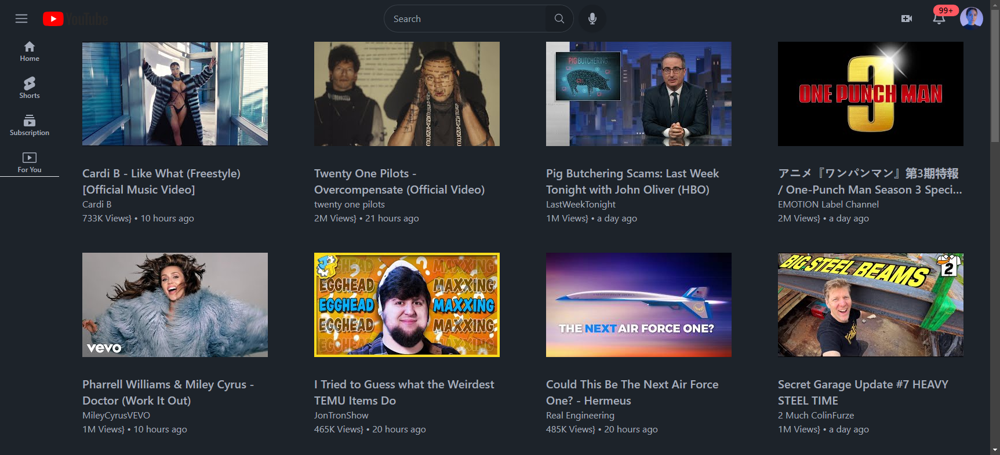
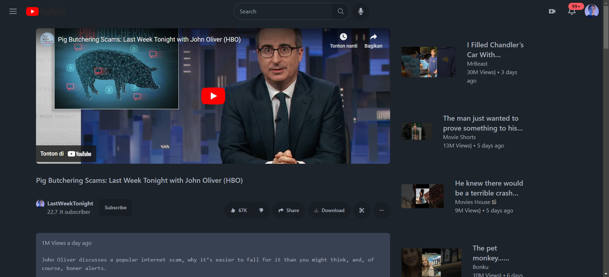

# HSBC Assignment #3: Reactjs

This is the solution of HSBC Assignment #3: Reactjs. In this assignment, students were asked to build a react app. Regarding that, this project is trying to create a youtube clone using [youtube data API v3](https://developers.google.com/youtube/v3).

## Table of contents

- [Overview](#overview)
  - [The challenge](#the-challenge)
  - [App Features](#app-features)
  - [Screenshot](#screenshot)
  - [Links](#links)
- [My process](#my-process)
  - [Built with](#built-with)
  - [Useful resources](#useful-resources)

## Overview

### The challenge

1. Create a react app that apply reusable component, state management, hooks, and routing

### App features

1. Search video using keywords
2. Play video and see video details
3. See video comments
4. See 404 page when the route doesn't exist
5. See video not found component when the video are not exist in youtube database

### Screenshot

### Links

- [Github repo](https://github.com/nurmarief/hsbc-assignment-3-reactjs/)
- [Live site](https://hsbc-assignment-3-reactjs.vercel.app/)

## My process

### Built with

- Reactjs + typescript
- Tailwindcss + daisyui
- React router dom
- Redux toolkit

### Useful Resources
- [Youtube data API v3](https://developers.google.com/youtube/v3)
